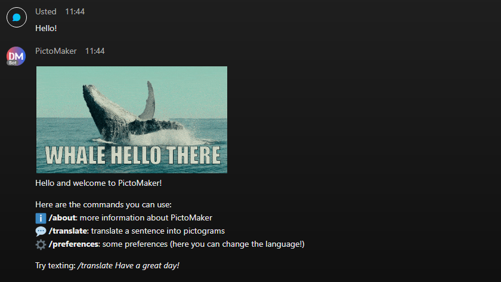
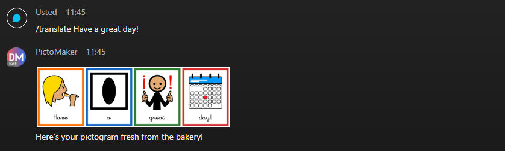
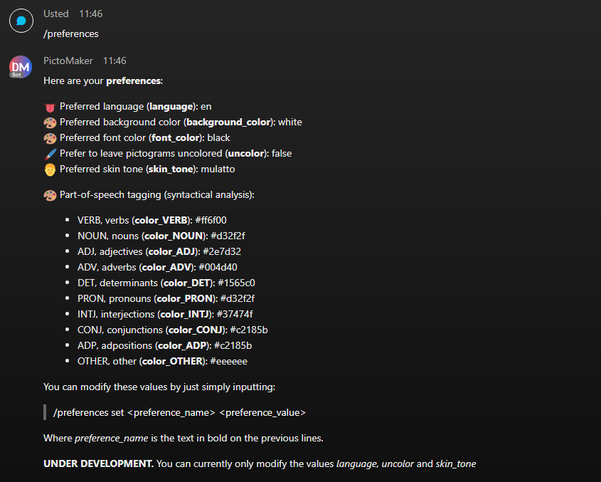
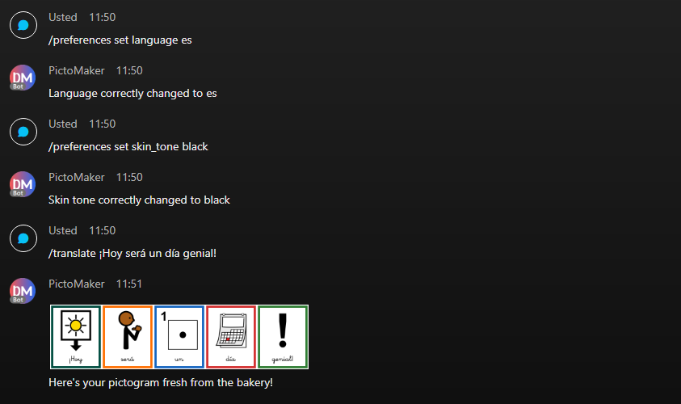
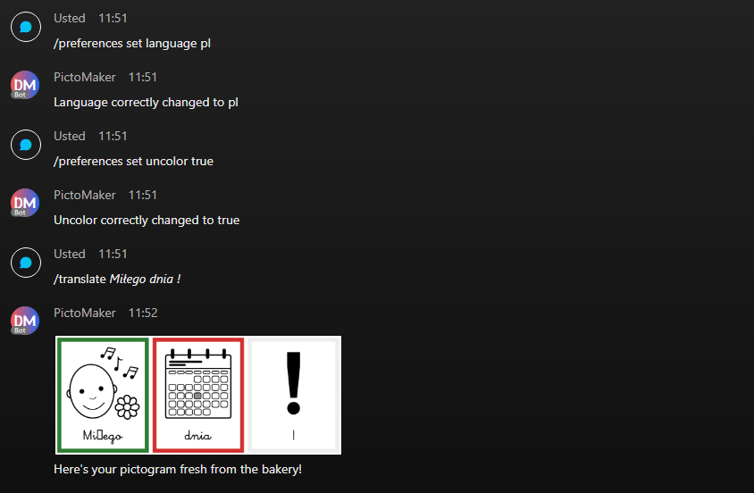
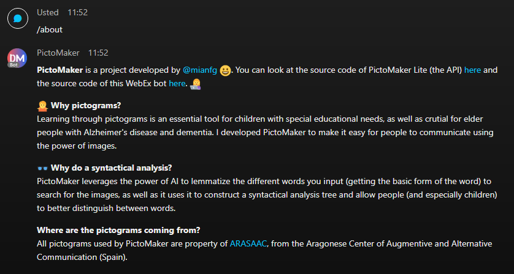

    

# PictoMaker WebEx Bot

> You can try out this bot by adding `pictomaker@webex.bot` to your WebEx!

## Motivation

A few years ago, and motivated by my mother, who is a teacher of students with special needs, I
decided to start the project **PictoMaker**. PictoMaker is basically a program that translates
sentences to colorful pictograms. It is able to:

* Make a syntactical analysis using Natural Language Processing for part-of-speech tagging. This is
  extremely useful for students who are learning the structure of language, or for elder people
  who have trouble understanding syntax.
* Use this NLP to make a lemmatization of the tokens and provide accurate images for each word.
  These images are part of the [ARASAAC](https://arasaac.org/) pictogram bank, from the Aragonese
  Center of Augmentive and Alternative Communication (Spain).
* Customize the colors associated with the POS tags.
* Customize whether the user wants the cards to be colored or not, and the skin tone of the people
  that appear in the pictograms.
* Provide an image generator that compiles the pictogram into one, colorful image.

Pictograms are an essential tool for children and elder people with Alzheimer's and dementia. The
[first version of PictoMaker](https://pictomaker.mianfg.me) I developed, only in Spanish, received
a warm reception from the educational community. I was really proud of it, and have always wanted
to make improvements to it. I though the opportunity to create a bot was perfect for this.

To improve PictoMaker and create a functional WebEx bot, I had to:

1. Create a new, improved and more lightweight version of PictoMaker. I decided to create an API
   that the WebEx bot could query. I named it **PictoMaker Lite**, and all the source code is
   free to see and use [here](https://github.com/mianfg/pictomaker-lite).
2. Create the WebEx bot, which is the code you can see in this folder of the repo.

## Features

PictoMaker's bot is able to provide a basic proof of the functionality of PictoMaker Lite. Once we
talk to the bot, it will output the following help message:

The idea is simple: just enter `/translate <sentence>` and it will be translated into a beautiful
array of pictograms.

This bot provides plenty of functionality. Thanks to a basic database (that we comment later), the
user config is persistent, not having to specify it each time the user wants to translate. You
can view all the preferences by texting `/preferences`.

> NOTE: not all preferences can be changed as of right now, as this is a proof-of-concept.

You can modify a specific preference using `/preferences set <preference_name> <preference_value>`. For example, here we change the language to Spanish and set the skin tone to black. We can now enter a sentence in Spanish to view the translation.

Another interesting feature of PictoMaker is that it can output the pictograms uncolored. Here you see how we even have Polish available!

> DISCLAIMER: I haven't found any child-written font with all the characters in the Polish alphabet, if you know one please open an issue [here](https://github.com/mianfg/Incu2022/issues/new/choose)!

Finally, you can know more about PictoMaker by texting `/about`.

## Quick thoughts regarding implementation

Here are the things I will comment briefly:

* Simple database for user preferences persistence.
* Always-on availability.

### Simple database for user preferences persistence

To store the user preferences, the WebEx code bot includes a [basic database application](./database.py) that stores values in plaintext using CSV and `pandas`. I developed this _database client_ for the [Python session](../python-session).

> NOTE: I thought to use MongoDB or SQLAlchemy, but for the purposes of this simple bot I preferred to keep it as simple as possible!

### Always-on availability

On the webinar for this task, the use of Ngrok was encouraged. However, given that I have a Virtual Private Server (VPS), I thought it was necessary to use it here!

My VPS has Ubuntu Server 20.04, and I use Nginx as reverse proxy. To make both applications reachable online and always on, I just had to use Gunicorn and some basic _sysadmin_ tricks!

Currently, the endpoints are:

* `https://lite.pictomaker.mianfg.me` for the PictoMaker Lite API.
* `https://webex.pictomaker.mianfg.me` for the WebEx Webhook.
